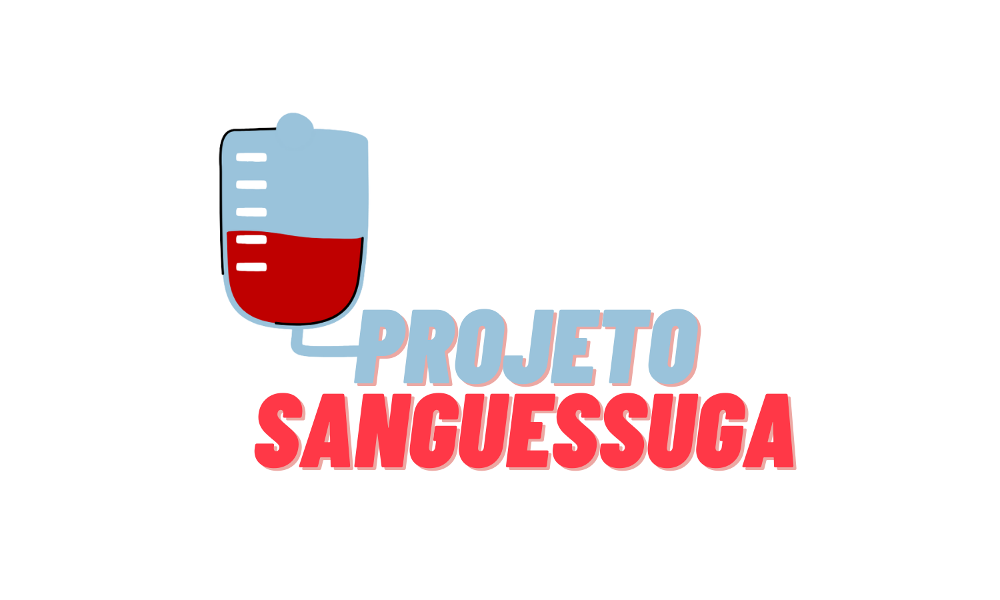

# Projeto Sanguessuga

  

Sistema web responsivo para doação de sangue. Esse projeto foi feito para a disciplina de Prática de Engenharia de Software 2020/2 - UFAM.

## Funcionalidades

- [x] Lista de centros de doação 
- [x] Doações feitas
- [x] Exibe estoque de sangue de cada centro
- [ ] Recompensas
- [ ] Emissão de declaração 
- [ ] Agenda de doação

#  Tecnologias

As seguintes ferramentas foram usadas na construção do projeto:

- [HTML](https://www.w3.org/html/)
- [CSS e SASS](https://www.w3.org/Style/CSS/Overview.en.html)
- [MySQL](https://www.mysql.com/)
- [JavaScript](https://www.javascript.com/try)
- [Handlebars](https://handlebarsjs.com/)
- [Canva](https://www.canva.com/)

# Autores

<table>
  <tr>
    <td align="center"><a href="https://twitter.com/thidemello"> <b>Thiago Braga</b></a> <a href="https://github.com/tbgdmelo" title="Code">💻</a></td>
    <td align="center"><a href="https://twitter.com/VKlisman"> <b>Victor Klisman</b></a> <a href="https://github.com/vklisman" title="Code">💻</a></td>
    <td align="center"><a > <b>Gabriel Domingos</b></a> <a href="https://github.com/GabrielDomingoss" title="Code">💻</a></td>
    <td align="center"><a> <b>Diego Libório</b></a> <a href="" title="Code">💻</a></td>

  </tr>
</table>

<h4 align="center"> 
	 🩸 Em construção...  🩸
</h4>

